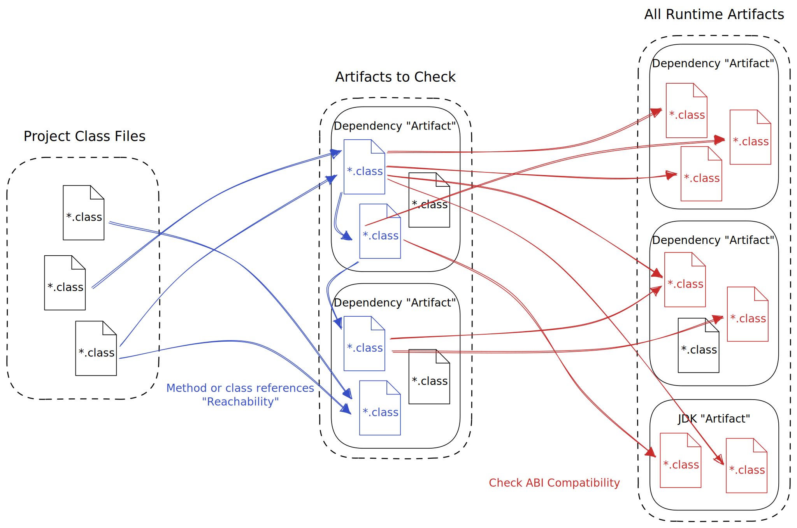

<p align="right">
<a href="https://autorelease.general.dmz.palantir.tech/palantir/gradle-transitive-abi-checker"></a>
</p>

## About gradle-transitive-abi-checker

A Gradle Plugin that will proactively "checks" your transitive dependencies for ABI incompatibilities.

## Quick start
To use this plugin, add the following to your root `build.gradle` file:

```gradle
buildscript {
    repositories {
        mavenCentral()
    }
    dependencies {
        classpath 'com.palantir.gradle.abi-checker:gradle-transitive-abi-checker:<latest_version>'
    }
}

apply plugin: 'com.palantir.transitive-abi-checker'
```

Then you can run `./gradlew checkAbiCompatibility` (or `.gradlew check`) to check for ABI incompatibilities.

See also [Configuration](#configuration) for more details on how to configure the plugin.

## Problem definition

Dependencies of your Java project are generally going to have dependencies of their own. These are what we call transitive dependencies.

A common problem is when multiple versions of the same transitive dependency are requested by different things.
In such a case, you want to select one version over the others, which [gradle-consistent-versions](https://github.com/palantir/gradle-consistent-versions) can help you do.

However, this selection process may cause a version discrepancy between the requested and resolved transitive dependency version.
This mismatch introduces a new avenue for runtime errors to occur. Dependencies without ABI hygiene may introduce [ABI incompatibilities](https://docs.oracle.com/javase/specs/jls/se23/html/jls-13.html) that the compiler will not catch, but which will cause runtime errors.

Here is a concrete example:

- You depend on libraries `X` and `Y`.
- `X` depends on `Z` version `1.0.0`.
- `Y` depends on `Z` version `2.0.0`.
- `X` instantiates class `Foo` from `Z`, which has been removed in version `2.0.0`.
- `Y` instantiates class `Bar` from `Z`, which has been added in version `2.0.0`.
- If you select version `1.0.0`, `Y` will fail at runtime because it expects `Bar` to be present.
- If you select version `2.0.0`, `X` will fail at runtime because it expects `Foo` to be present.
  - Note: this is generally what is going to happen with [gradle-consistent-versions](https://github.com/palantir/gradle-consistent-versions), as it will select the highest version. 

### ABI incompatibilities we guard against
There are a lot of possible ABI incompatibilities that can occur when a dependency is updated.

The [Java Language Specification](https://docs.oracle.com/javase/specs/jls/se23/html/jls-13.html) provides a detailed list of examples.

This plugin doesn't cover all of them at this time.
The [integration tests](abi-check-core/src/test/java/com/palantir/abi/checker/integration) provide concrete examples of the ones we support.

For now, we are seeking to detect the following ABI incompatibilities:
- A class being not found (e.g. renamed, moved, deleted)
- A method being not found (whether due to a rename, deletion, or its signature changing)
- A field being not found

Additional support for other types of incompatibilities will be added over time.

See also the [FAQ section](#faq) for a few edge cases.

### How this plugin works

This Gradle plugin works in two stages:
- Identify the reachable code.
- For every piece of code that is reachable, ensure that the binaries from the dependency are compatible with the binaries from the selected versions of its transitives.

The image below is a rough summary of the process:


To determine the reachable code, the plugin starts from the classes of the current project, then it recursively identifies class references as a proxy for reachability.

_Note: In the current implementation, we only look for referenced classes, but don't do more fine-grained analysis (e.g. whether specific methods of a class are reachable).
This might cause us to flag false positives based on code that is not in fact reachable._

Then, for each reachable class, we will inspect its bytecode and compare it with the bytecode of its referenced classes/methods/fields.

For instance, if the class refers to a specific method in a target class, we will verify that both the class and the method (with its _exact_ signature) can be found. If not, they will be flagged as a conflict.

## Configuration

This plugin exposes a few configuration points. Configuration is exposed on a per project level allowing for granular, targeted overrides.

The top level DSL block starts with `transitiveAbiChecker`. Here is an example with inline documentation:

```gradle
transitiveAbiChecker {
    
    // Allows you to control the artifacts that produce build failures.
    // 
    // Specificity can be dialed up to a fully qualified Maven coordinate.
    // If you want to check everything without specifying "" as a prefix enable 'checkCompletely' (see below)
    //
    // Note: If an artifact matches this configuration and the 'getIgnoredArtifactPrefixes' configuration, then
    // the ignored setting wins. The reasoning being that enablement is likely wide while ignoring is likely targeted.
    errorArtifactPrefixes = [
        "com.palantir",
        "group:name:1.2.3",
    ]
    
    // A set of prefixes used to "ignore" artifacts when searching for ABI incompatibilities
    //
    // Note: If an artifact matches this configuration and the 'errorArtifactPrefixes' configuration, then
    // this setting wins. The reasoning being that enablement is likely wide while ignoring is likely targeted.
    ignoredArtifactPrefixes = [
        "org.apache.hadoop"
    ]
    
    // A set of prefixes used to "ignore" classes when searching for ABI incompatibilities
    ignoredClassPrefixes = [
        "org.apache.hc.client5"
    ]
    
    // A set of keywords used to "ignore" artifacts and classes when searching for ABI incompatibilities
    ignoredKeywords = [
        "esoterics"
    ]
    
    // Signals to the checker to ignore the current modules "entry point classes" and instead "completely check"
    // all artifacts that match the above filtering.
    //
    // This is a pretty rare feature and is frankly only useful for very strict modules, or modules that have 
    // no main source set (i.e. shaded jar containers).
    checkCompletely = true
}
```

## Caveats and limitations

### Reflection
This plugin does not follow reflective call graphs and is therefore unable to verify ABI breaks beyond that link.

### Dependency Injection frameworks
Some dependency injection frameworks (e.g. Guice) use reflection to load classes, which will hit the same limitation as above (see [Reflection](#reflection)).

### Unexecuted code paths
Because this plugin analyses the bytecode statically and does not execute it, it is unable to determine whether a specific branch will be executed or not at runtime and will analyse it regardless.

## Credit

The core infrastructure and algorithms are "forks" of [Spotify's MissingLink Maven plugin](https://github.com/spotify/missinglink/).

According to one of the maintainers, it never gained traction internally and was moved into maintenance mode. We had a desire to improve the tool, make it more fit for our purpose, and use our common tooling. As such we "forked" (in-sourced) their core library and extended it.

Internally, this project was originally started by [Brandon Marc-Aurele](https://github.com/bmarcaur) and continued by [Alexis Le Dantec](https://github.com/aldexis).

## License

This project is made available under the
[Apache 2.0 License](http://www.apache.org/licenses/LICENSE-2.0).

## FAQ

### I have a conflict telling me a class is failing to find a method on itself. Can this be correct?

This can indeed happen in cases where the class itself extends another class or implements an interface from a different library, 
which has that method's default implementation, and that method was changed in an incompatible way (removed / updated signature).

In this case, we would traverse the class hierarchy and try to find the method on any of the super classes, but (correctly) fail to do so.
Because there _is_ in fact no such method on any class, we correctly report that we failed to find the method on the original class.

Concretely:
```java
class A extends B {
    A() { method(); }
}

class B {
    void method() {}
}
```
would break if `method()` was removed from `B` in the new version of the library.
